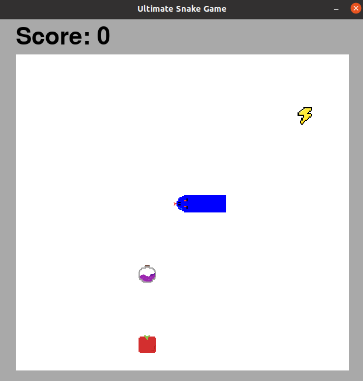

# Ultimate Snake Game

## Objective

Ultimate snake game is our take on the classice snake arcade game. The main functionality is as follows:

1. Move the snake up, down, left, or right.
2. Eat as many items as possible.
    - each time the snake eats an item, it grows in length and the score increases by one
    - each time an item is eaten, a new item spawns in a random location
3. The game ends if the snake hits itself or the wall.

The goal of the game is to get the highest score possible. 

## Unique Features

Unlike a typical snake game, our game has special items! Below are all the possible items that the snake can eat.

     

All items increase the score and length of the snake by one when eaten. The apple has no other effect, the lightning gives a temporary speed boost, and the potion makes the snake invisible for a couple seconds.

## Installation

To install the game, please visit our repository at https://github.com/olincollege/ultimate-snake and download the repository. In addition, to play this game pygame must be installed. To install it, run the command `pip install pygame` in the terminal. More information on pygame can also be found here: https://www.pygame.org/wiki/GettingStarted.

## How to Play

To play the game first go into the ultimate-snake-game repository and run `python snake_game.py`.

 
Next, to begin the game, press the yellow "Play Now!" button.

 
To begin playing, simply press any of the arrow keys (but remember that if the snake hits itself it dies).

 
If your snake dies, you will be brought to the end screen as seen above. If you press the yellow "Restart" button, you will be brought back to the starting screen.

## Creators

\
<a href="https://www.linkedin.com/in/antoinette-tan/">Antoinette Tan</a>\
Olin College of Engineering 2024\
Electrical and Computer Engineering

## Resources

To create the item images and the head of the snake we used https://www.pixilart.com/.
